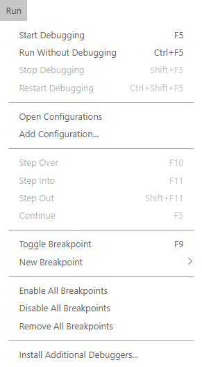
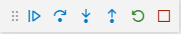
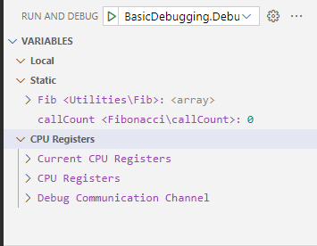
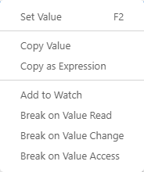
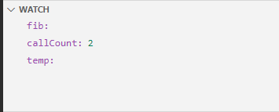
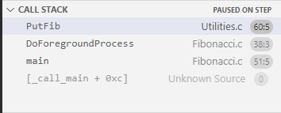
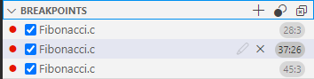
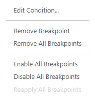

# IAR C-SPY Debug&mdash;Debugging projects

The IAR C-SPY Debug extension lets you perform basic debugging of an existing IAR Embedded Workbench project or a stand-alone application. It supports most of the IAR C-SPY Debug drivers that IAR Embedded Workbench supports, and uses the **Disassembly**, **Memory**, **Peripheral**, and **RTOS** views provided by VS Code or the VS Code Embedded Tools extension.

For more information about debugging a stand-alone application, see [Debugging a stand-alone application](#debuggingstandaloneprogram).

To debug an IAR Embedded Workbench (`.ewp`) project, we highly recommend also installing the [IAR Build](https://marketplace.visualstudio.com/items?itemName=iarsystems.iar-vsc) extension. This extension will automatically provide debug configurations for your project.

To debug a project without the IAR Build extension, you must manually provide a debug configuration. For information, see [The launch.json format](#launch-json-format). The descriptions in this guide assume that you have installed the IAR Build extension.

If you do not have a `launch.json` file in the workspace, click **Run and Debug** in the **Run and Debug** view to start debugging the current project and configuration.

If you already have a `launch.json` file, the automatic C-SPY debug configurations can be accessed by choosing **IAR C-SPY Debug** from
the debug configuration dropdown menu.

## Table of contents

* [Customizing a debug configuration](#CustomizingADebugConfig)

* [Making IAR C-SPY Debug settings](#MakingIARC-SPYDebugSettings)

* [Run menu](#RunMenu)

* [The Side Bar views](#IARBuildTasks)

* [Breakpoint types](#BreakpointTypes)

* [Debugging a stand-alone application](#debuggingstandaloneprogram)

* [The launch.json format](#launch-json-format)

<h2 id="CustomizingADebugConfig">Customizing a debug configuration</h2>

If you have installed the [IAR Build](https://marketplace.visualstudio.com/items?itemName=iarsystems.iar-vsc) extension, the IAR C-SPY Debug extension automatically provides debug configurations for your project.

To change debugging parameters or set up VS Code to automatically build your project before starting a debug session, you can create a `launch.json` configuration.

Click on **Show all automatic debug configurations** in the **Run and Debug** view, select **IAR C-SPY Debug** and click on the gear icon next to the configuration you want to customize. A `launch.json` file is created, or opened if one exists already. There are some basic templates for you to base your own debug configuration on. To access these, choose **Run>Add Configuration>{ } C-SPY Debug: Generic launch configuration**.

See [The launch.json format](#launch-json-format) for a description of the format.

### Missing debug configuration settings files

With some versions of IAR Embedded Workbench, the IAR C-SPY Debug extension uses files generated by the IDE to provide automatic debug configurations. These files are placed in the `settings` subdirectory in your IAR Embedded Workbench workspace directory, and have filenames that end in `driver.xcl` and `general.xcl`.

If the IAR C-SPY Debug extension fails to launch a debug session and asks you to debug the project in the IAR Embedded Workbench IDE first, this means that the required configuration settings files are missing. To generate them, you must open the project in the IAR Embedded Workbench IDE and first start and then close a debug session for each project configuration you want to generate the configuration settings files for.

<h2 id="MakingIARC-SPYDebugSettings">Making IAR C-SPY Debug settings</h2>

To make settings for IAR C-SPY Debug, choose **File>Preferences>Settings** and select the **Extensions** category in the side pane of the **Settings** view, and locate **IAR C-SPY Debug** in the list of extensions.

You can click on the cog wheel to the right of the setting name to reset the setting to its factory setting, copy the setting ID, or copy the setting in JSON format.

**Note:** Project settings cannot be made from VS Code, they must be made in the IAR Embedded Workbench IDE.

<h2 id="RunMenu">Run menu</h2>



Some of the commands on the **Run** menu are also available as buttons on the Debug Bar.



**Start Debugging (F5)**, also available as a Debug Bar button.

Executes from the current statement or instruction until a breakpoint or program exit is reached.

**Run without Debugging**

Executes the application without using debug info.

**Stop Debugging (Shift+F5)**, also available as a Debug Bar button.

Stops the application execution.

**Restart Debugging (Ctrl+Shift+F5)**, also available as a Debug Bar button.

Resets the target processor.

**Open Configurations**

See the VS Code documentation.

**Add Configuration**

See the VS Code documentation.

**Step Over (F10)**, also available as a Debug Bar button.

Executes the next statement, function call, or instruction, without entering C or C++ functions or assembler subroutines.

**Step Into (F11)**, also available as a Debug Bar button.

Executes the next statement or instruction, or function call, entering C or C++ functions or assembler subroutines.

**Step Out (Shift+F11)**, also available as a Debug Bar button.

Executes from the current statement up to the statement after the call to the current function.

**Toggle Breakpoint**

Toggles a breakpoint at the cursor in the **Editor** view.

**New Breakpoint**

This command cannot be used with IAR C-SPY Debug.

**Enable All Breakpoints**

Enables all defined breakpoints.

**Disable All Breakpoints**

Disables all defined breakpoints.

**Remove All Breakpoints**

Removes all defined breakpoints.

**Install Additional Debuggers**

Opens the Extensions Marketplace where you can find other debuggers to install.

<h2 id="IARBuildTasks">The Side Bar views</h2>

When you debug your project, these views are available in the Side Bar.

### Variables view



These types of variables are can be inspected in the **Variables** view:

* Local

* Static

* CPU Registers. The CPU registers are grouped in register groups.

Clicking the **View Binary Data** button opens the **Memory** view, where you can inspect the variable as binary data in memory. See [Memory view](#MemoryView).

On the context menu are commands for setting or copying the value of the selected variable.



Depending on the type of variable, there can also be commands for copying the variable as an expression or adding it to the **Watch** view. For *static* variables, the command:

* **Break on Value Read** sets a data breakpoint that triggers when a value is read from that location,

* **Break on Value Change** sets a data breakpoint that triggers when a value is written to that location

* **Break on Value Access** sets a data breakpoint that triggers when a value is either read or written from that location.

### Watch view



Use this view to monitor the values of C-SPY expressions or variables. Tree structures of arrays, structs, and unions are expandable, which means that you can study each item of these. Every time execution stops, the values in the **Watch** view are recalculated.

Use the context menu, or click the plus icon, to add an expression to this view. Use the context menu to remove all expressions from the view.

### Call Stack view



This view displays the C function call stack with the current function at the top. To inspect a function call, double-click it. The debugger now focuses on that call frame instead.

Use the context menu to copy the call stack, if you want to save it to a file for analyzing. You can also use the context menu to display the selected function in the **Disassembly** view. See [Disassembly view](#DisassemblyView).

### Breakpoints view



Use this view to add new breakpoints, or toggle breakpoints on and off. Hover over a breakpoint to see the details.

For information on specifying which type of breakpoints to use, hardware or software breakpoints, see [Breakpoint types](#BreakpointTypes).

#### Context menu

Right-click in the **Breakpoints** view to open the context menu.



**Edit Condition**

Brings up an input field where you can edit the selected breakpoint. Choose between:

* **Expression** : Specify an expression. The breakpoint triggers when the expression evaluates to true.

* **Hit Count** : Specify the number of times that the breakpoint condition must be fulfilled before the breakpoint triggers for the first time.

* **Log Message** : Specify a message to be sent to the log when the breakpoint triggers.

This command is also available as a pen icon next to the name of the breakpoint.

**Remove Breakpoint**

Removes the selected breakpoint.

**Remove All Breakpoints**

Removes all defined breakpoints.

**Enable All Breakpoints**

Enables all defined breakpoints.

**Disable All Breakpoints**

Disables all defined breakpoints.

**Reapply All Breakpoints**

Restores all defined breakpoints to their original locations. This is helpful if your debug environment has "misplaced" breakpoints in source code that has not yet been executed.

<h3 id="DisassemblyView">Disassembly view</h3>

This view is provided by the VS Code and can be opened by right-clicking in the **Call Stack** view. See this article for an overview: [Disassembly view](https://devblogs.microsoft.com/cppblog/visual-studio-code-c-july-2021-update-disassembly-view-macro-expansion-and-windows-arm64-debugging/#disassembly-view)

<h3 id="MemoryView">Memory view</h3>

 This view is a hex editor that can be opened by clicking on the **View Binary Data** icon to the right of a static variable in the **Variables** view. The view opens at the variable's location in memory. Arbitrary memory locations cannot be opened.

This view is provided by the VS Code.

### Peripheral view

This view is provided by the VS Code Embedded Tools extension. See the VS Code documentation for more information.

### RTOS view

This view is provided by the VS Code Embedded Tools extension. See the VS Code documentation for more information.

<h2 id="BreakpointTypes">Breakpoint types</h2>

For most debugger drivers, the IAR C-SPY Debugger lets you decide whether to use hardware breakpoints, software breakpoints, or whether to let the driver decide the type to use. To work with breakpoint types, use the commands on the command palette.

Press F1 or Ctrl+Shift+P and start typing `IAR` to find the **IAR Debug: Set Breakpoint Type:** commands.

* **Set Breakpoint Type: Auto** - Makes all new breakpoints use software breakpoints, for this and future debug sessions. If this is not possible, a hardware breakpoint will be used.
* **Set Breakpoint Type: Auto (Current Session Only)** - Makes any new breakpoints set during this debug session use software breakpoints. If this is not possible, a hardware breakpoint will be used.
* **Set Breakpoint Type: Hardware** - Makes all new breakpoints use hardware breakpoints, for this and future debug sessions. If this is not possible, no breakpoint will be set.
* **Set Breakpoint Type: Hardware (Current Session Only)** - Makes any new breakpoints set during this debug session use hardware breakpoints. If this is not possible, no breakpoint will be set.
* **Set Breakpoint Type: Software** - Makes all new breakpoints use software breakpoints, for this and future debug sessions. If this is not possible, no breakpoint will be set.
* **Set Breakpoint Type: Software (Current Session Only)** - Makes any new breakpoints set during this debug session use software breakpoints. If this is not possible, no breakpoint will be set.
* **Set Breakpoint Type: Trace Start** - Makes all new breakpoints use trace start breakpoints, for this and future debug sessions. When the breakpoint is triggered, the trace data collection starts. Note that this command is only available if the C-SPY driver you are using supports it.
* **Set Breakpoint Type: Trace Start (Current Session Only)** - Makes any new breakpoints set during this debug session use trace start breakpoints. When the breakpoint is triggered, the trace data collection starts. Note that this command is only available if the C-SPY driver you are using supports it.
* **Set Breakpoint Type: Trace Stop** - Makes all new breakpoints use trace stop breakpoints, for this and future debug sessions. When the breakpoint is triggered, the trace data collection stops. Note that this command is only available if the C-SPY driver you are using supports it.
* **Set Breakpoint Type: Trace Stop (Current Session Only)** - Makes any new breakpoints set during this debug session use trace stop breakpoints. When the breakpoint is triggered, the trace data collection stops. Note that this command is only available if the C-SPY driver you are using supports it.
* **Set Breakpoint Type: Trace Filter** - Makes all new breakpoints use trace filter breakpoints, for this and future debug sessions. A trace filter specifies conditions that, when fulfilled, activate the trace data collection. Note that this command is only avalable if your setup supports it.
* **Set Breakpoint Type: Trace Filter (Current Session Only)** - Makes any new breakpoints set during this debug session use trace filter breakpoints. A trace filter specifies conditions that, when fulfilled, activate the trace data collection. Note that this command is only avalable if your setup supports it.
* **Set Breakpoint Type: Flash** - Makes all new breakpoints use flash breakpoints, for this and future debug sessions. This command is only available for the C-SPY I-jet driver.
* **Set Breakpoint Type: Flash (Current Session Only)** - Makes any new breakpoints set during this debug session use flash breakpoints. This command is only available for the C-SPY I-jet driver.
* **Set Breakpoint Type: Timer Start** - Makes all new breakpoints use timer start breakpoints, for this and future debug sessions. When the breakpoint is triggered, a timer is started. This command is only available for RH850.
* **Set Breakpoint Type: Timer Start (Current Session Only)** - Makes any new breakpoints set during this debug session use timer start breakpoints. When the breakpoint is triggered, a timer is started. This command is only available for RH850.
* **Set Breakpoint Type: Timer Stop** - Makes all new breakpoints use timer stop breakpoints, for this and future debugging sessions. When the breakpoint is triggered, the running timer is stopped. This command is only available for RH850.
* **Set Breakpoint Type: Timer Stop (Current Session Only)** - Makes any new breakpoints set during this debug session use timer stop breakpoints. When the breakpoint is triggered, the running timer is stopped. This command is only available for RH850.

Note that these commands do not affect existing breakpoints. To change the type of an existing breakpoint, right-click the breakpoint and choose **Edit Breakpoint...**. In the **Mode...** drop-down, select the wanted breakpoint type. You can also set the breakpoint type globally and then remove and re-add the breakpoint (or disable and reenable it).

<h2 id="debuggingstandaloneprogram">Debugging a stand-alone application</h2>

You can use the IAR C-SPY Debug extension to debug a stand-alone application without an associated `.ewp` project, such as an application built with CMake.

Because there is no project to automatically generate a debug configuration from, you must manually provide a debug configuration
in the form of a `launch.json` file.

There are two ways to do this:

* Use the IAR Embedded Workbench IDE to create an empty project and select the desired device, driver, and options. Then, follow the instructions for [customizing a debug configuration](#CustomizingADebugConfig) from an IAR Embedded Workbench project, to create a `launch.json` file that you can copy to your VS Code workspace folder and use to start a debugging session.

* Create the `launch.json` configuration yourself. Choose **Run>Add Configuration** and select **C-SPY Debug: Generic launch configuration**. See [the launch.json format](#launch-json-format) for help with filling in the provided stub.

<h2 id="launch-json-format">The launch.json format</h2>

Visual Studio Code uses a file called `launch.json` to manage custom debug configurations. For detailed descriptions, see [Launch configurations](https://code.visualstudio.com/Docs/editor/debugging#_launch-configurations) and [Launch.json attributes](https://code.visualstudio.com/Docs/editor/debugging#_launchjson-attributes).

The easiest way to generate a `launch.json` configuration is from an IAR Embedded Workbench project, see the description under [Debugging a stand-alone application](#debuggingstandaloneprogram), but you can also write one yourself. This stub can get you started:

```json
{
            "type": "cspy",
            "request": "launch",
            "name": "My I-jet Config",
            "target": "arm",
            "program": "${workspaceFolder}/Debug/Exe/BasicDebugging.out",
            "driver": "jet",
            "stopOnSymbol": "main",
            "workbenchPath": "${command:iar-settings.toolchain}",
            "projectPath": "${workspaceFolder}",
            "projectConfiguration": "Debug",
            "leaveTargetRunning": false,
            "trace": false,
            "driverOptions": [
                "--crun=disabled",
                "--endian=little",
                "--cpu=Cortex-M4",
                "--fpu=VFPv4_SP",
                "-p",
                "${command:iar-settings.toolchain}/arm/CONFIG/debugger/ST/STM32F429II.ddf",
                "--semihosting",
                "--device=STM32F429II",
                "--multicore_nr_of_cores=1",
                "--jet_standard_reset=9,0,0",
                "--reset_style=\"0,-,0,Disabled (no reset)",
                "--reset_style=\"1,-,0,Software",
                "--reset_style=\"2,-,0,Hardware",
                "--reset_style=\"3,-,0,Core",
                "--reset_style=\"4,-,0,System",
                "--reset_style=\"9,ConnectUnderReset,1,Connect during reset",
                "--jet_power_from_probe=leave_on",
                "--drv_interface=SWD",
                "--jet_cpu_clock=180000000",
                "--drv_catch_exceptions=0xff0"
            ],
            "download": {
                "flashLoader": "${command:iar-settings.toolchain}/arm/config/flashloader/ST/FlashSTM32F427xI.board",
                "deviceMacros": [
                    "${command:iar-settings.toolchain}/arm/config/debugger/ST/STM32F4xx.dmac"
                ]
            }
        }
```

For information about each supported attribute, see the autocompletion and tooltips in the `launch.json` file.

The `driverOptions` attribute takes C-SPY command line parameters. For reference information, see *The C-SPY command line utility—cspybat* in the *IAR Embedded Workbench C-SPY® Debugging Guide* (PDF).

The current version of the IAR C-SPY Debug extension adds support for leaving the application running after the debug session is closed (`"leaveTargetRunning": true`) and for making the debugger attach to a running application at its current location, without resetting the target system (`"request": "attach"`). You can, for example, use this to create one debug configuration to flash and launch your application in C-SPY, and one configuration to reattach to the application when needed.

If you have installed the [IAR Build](https://marketplace.visualstudio.com/items?itemName=iarsystems.iar-vsc) extension, and have specified a `projectPath` and a `projectConfiguration` in your `launch.json` configuration, you can omitt other `launch.json` fields to have them automatically filled from the referenced project configuration. For example, a `launch.json` configuration where all missing fields are taken from the selected project configuration can look like this:

```json
{
    "type": "cspy",
    "request": "launch",
    "name": "Debug the active IAR Project with C-SPY",
    "workbenchPath": "${command:iar-config.toolchain}",
    "projectPath": "${command:iar-config.project-file}",
    "projectConfiguration": "${command:iar-config.project-configuration}"
}

```
