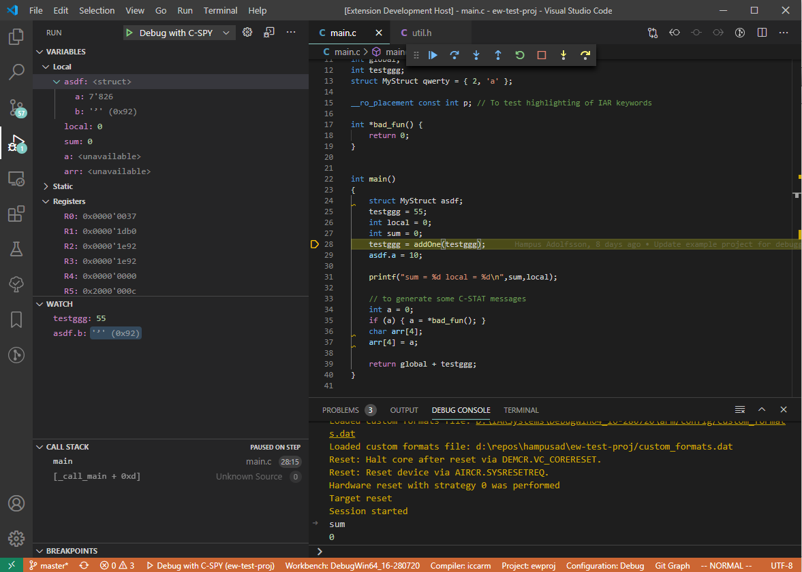

# C-SPY Debugging in VS Code

VS Code uses a generic (i.e. language- and debugger-agnostic) protocol to communicate
with debuggers, called the Debug Adapter Protocol (**DAP**). Integrating an existing
debugger with VS Code is done by implementing a Debug Adapter, that communicates with
VS Code on one end (using the DAP) and the actual debugger on the other end (in the
case of C-SPY, using thrift).

Last year I created a prototype Debug Adapter using `CSpyRuby` (see section 7 & 8 of [the report I wrote on it](http://git.iar.se/gitweb.cgi?p=user/hampusad.git;a=blob;f=report.pdf;h=5e9786d5e3805619a9a4f17482bb4b0997eb7cef;hb=HEAD)).
The Debug Adapter I describe in this report is an attempt to create something
closer to being able to be released to customers, using `CSpyServer2` and Thrift
instead of `CSpyRuby`. However, it still needs a lot of work (mostly polishing
and testing) before it is ready to be used by anyone.

## What's been achieved

The new Debug Adapter supports most basic debug functionality, such as:

* Run control (pausing, stepping, restarting)
* Breakpoints (only code breakpoints)
* Call stack
* Variable and register inspection (even for expandable variables, e.g. structs)
* Watch window
* Mouse hover inspection
* C-SPY log output

I have tested this with the simulator, J-link and I-jet drivers.

## Thoughts on the Debug Adapter Protocol

The DAP aims to be a protocol for pretty much any editor and any debugging backend (there are editors besides VS Code that also support DAP, but most don't do it very well).
This broad scope means that the DAP's set of functionality is fairly generic,
and a lot of the more
specific C-SPY functionality (e.g. register groups, macros or modifying memory contents)
won't be supported by the DAP.

There are ways to extend the DAP to add support for more functionality, but by doing so one loses
the main advantages of the DAP: simplicity and cross-editor compatibility. One would have to
implement the frontend for all extended functionality oneself, and replicate that frontend for
every editor in which one wants to support that functionality. In VS Code specifically,
implementing usable custom UI elements is very difficult, altough other DAP-supporting editors
(e.g. Theia or Eclipse) might not have that problem.

This means that if one wanted to replicate the *entire* C-SPY experience in e.g. VS Code or Theia,
the DAP probably wouldn't be of much help.
However, the stripped-down debugging functionality that the base DAP offers might be enough for
VS Code; it's not really in the spirit of VS Code to have too much complex, IDE-like functionality.

## Thoughts on the (thrift) C-SPY API

Parts of the C-SPY thrift API presents data as abstract cells in list windows with loosely defined columns,
and the idea is that the frontend doesn't need to be aware of what the data represents, only how
to render it.
The DAP, on the other hand, purposefully avoids GUI abstractions. Instead it requires data to be
formatted in very specific ways and with very specific meanings. This places the Debug Adapter
in an inconvenient position where it has to make assumptions about and parse the contents of these
abstract windows, in order to generate DAP-formatted data.

The two protocols also have incompatibilities in *when* data is sent from the backend to the frontend.
The DAP is centered around *requests* for data made from the frontend to the backend. For example, when
the debugger stops on a breakpoint, the frontend sends a DAP request for all stack frames and then
for all variables in the topmost frame.
The C-SPY API is very different;
each window backend pushes updates to the frontend **in its own time**, whenever the data is ready.
This makes it complicated for the Debug Adapter to ensure it is responding to DAP requests
with fresh data,
and there is no way to update or amend the data after it has been sent to the frontend.

Parts of the thrift API that do not use list windows have neither of these problems, of course,
and generally work very well with the DAP. I could probably have relied less on list windows
and more on synchronous thrift calls, but some list window data did not seem to be available from
synchronous calls (e.g. variable locations).

## Generating debug configurations

The thrift API expects the client/frontend to provide a full debugging configuration
(e.g. driver parameters). To avoid having to replicate the entire debug configuration
UI from EW or eclipse, I opted to try to parse a debug configuration from the project files,
to replicate the debug configuration the user has defined in EW. My solution parses `cspybat` files and works
in *some* cases, but it would very helpful if there was a proper and easy way for a client
to configure the debugger from a set of project files without having to know too much about the
process (maybe there could be a thrift procedure for this?).

## How this relates to `iar-vsc`

The debugging project consists of two parts:

* The Debug Adapter described above.
* A small VS Code extension that tells VS Code how to launch the Debug Adapter.

The extension shares virtually no code with `iar-vsc` (the other VS Code extension I have worked on,
which is open-source and maintained by someone not affiliated with IAR).
This means that if we wanted to release this, we could release it as a totally separate, debugging-only
extension. That way, we wouldn't have to open-source it and we'd be more in control of the development and
release process. It'd be slightly confusing to users, though.

Extensions are usually published to the VS Code marketplace using a command-line tool called `vsce`.
The official documentation has examples on [how to build, test and publish an extension](https://code.visualstudio.com/api/working-with-extensions/continuous-integration)
using Azure Pipelines, but it probably also applies to Jenkins.

The code for this project is in [my git repo](http://git.iar.se/gitweb.cgi?p=user/hampusad.git;a=tree;f=vscode-mock-debug;hb=HEAD).