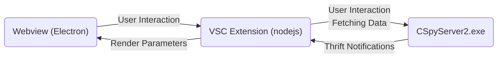
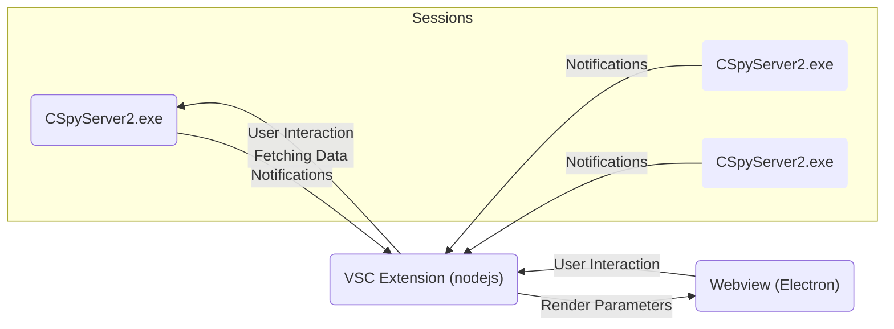

# Listwindow Architecture

The code in this folder sits between the webview code (see `webviews/listwindow`)
and the listwindow backends in CSpyServer, similar to the `ListwindowProxy` concepts
in the IDE and Eclipse. It is responsible for connecting to the backend whenever
a debug session starts and fetching data from it, as well as instantiating the
listwindow webviews and sending render parameters to them:

Note that the debug adapter is not involved here. It is simpler and more
future-proof to have the extension speak thrift to CSpyServer directly. The only
communication with the debug adapter will be at the start of a session; since
the debug adapter owns the CSpyServer instance, we need to ask it where the
service registry is located.

Also note that VS Code can have multiple debug sessions running at the same
time, but we will only have one instance of each listwindow webview. In this
case, we maintain an active connection to each backend, but make sure to only
render data from and send user interactions to the backend for the session that
VS Code considers the "active" one:

