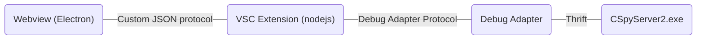

# Webviews

This folder contains code for custom "Webview" based views. For a general
introduction to webviews, see Microsoft's [Webview
Guide](https://code.visualstudio.com/api/extension-guides/webview).

Each webview contains an entry point (`index.ts`), which is compiled and bundled
by webpack into a javascript file. In the VS Code extension, a webview provider
then initializes the webview and creates some boilerplate HTML which loads the
javascript file.

## Communication

The webview provider (i.e. the extension) and the view itself run in separate
contexts and cannot directly interact. Instead, they use an API provided by VS
Code to send JSON objects between each other. Code in this folder can be
imported by regular extension code, so it is advised to define the object types
used for communication in a shared file here (see
[listwindow/protocol.ts](listwindow/protocol.ts) for an example).

